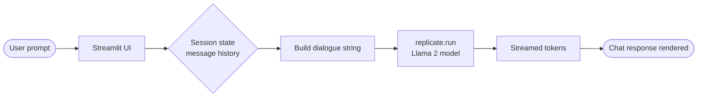

<h1 align="center">Llama-2 Chatbot</h1>

<p align="center"><em>A lightweight Streamlit chat interface powered by Meta's Llama 2 via the Replicate API</em></p>

<p align="center">
  
  
  
  
</p>

---

## Overview

A minimal Streamlit web app that lets you chat with Meta's Llama 2 language models. It calls the models hosted on [Replicate](https://replicate.com/) and requires only a Replicate API token to run. Refactored from [a16z's llama2-chatbot](https://github.com/a16z-infra/llama2-chatbot) to be lightweight enough for deployment on Streamlit Community Cloud.

Two entry points are included:

| File | Description |
|---|---|
| `streamlit_app.py` | Minimal version — fixed Llama2-70B model, no parameter controls |
| `streamlit_app_v2.py` | Extended version — model selector (7B / 13B / 70B) plus temperature, top-p, and max-length sliders |

---

## Features

- Chat interface with persistent message history and a "Clear Chat History" button
- Supports all three Llama 2 chat model sizes: **7B**, **13B**, and **70B** (v2 app)
- Adjustable generation parameters: temperature, top-p, max output length (v2 app)
- API token entered at runtime via sidebar text input or pre-loaded from Streamlit secrets

---

## Tech Stack

- **Python** — application logic
- **Streamlit** — web UI and session state
- **Replicate Python SDK** — inference API calls to hosted Llama 2 models

---

## Getting Started

### Prerequisites

- Python 3.8 or later
- A [Replicate](https://replicate.com/) account and API token (starts with `r8_`)

### Install

```bash
git clone https://github.com/Gustav-Proxi/Llama-2-chatbot.git
cd Llama-2-chatbot
pip install -r requirements.txt
```

### Configure API token

**Option A — at runtime:** Enter your token in the sidebar when the app loads.

**Option B — via Streamlit secrets** (recommended for deployment):

```toml
# .streamlit/secrets.toml
REPLICATE_API_TOKEN = "r8_your_token_here"
```

---

## Usage

Run the extended version (model selector + parameter controls):

```bash
streamlit run streamlit_app_v2.py
```

Or the minimal version (fixed Llama2-70B):

```bash
streamlit run streamlit_app.py
```

The app opens in your browser at `http://localhost:8501`.



---

## Project Structure

```
Llama-2-chatbot/
├── streamlit_app.py       # Minimal app — fixed 70B model
├── streamlit_app_v2.py    # Extended app — model selector + sliders
├── requirements.txt       # streamlit, replicate
└── .streamlit/
    └── config.toml        # UI theme
```

---

## Acknowledgements

Refactored from [a16z-infra/llama2-chatbot](https://github.com/a16z-infra/llama2-chatbot). Models hosted on [Replicate](https://replicate.com/).
